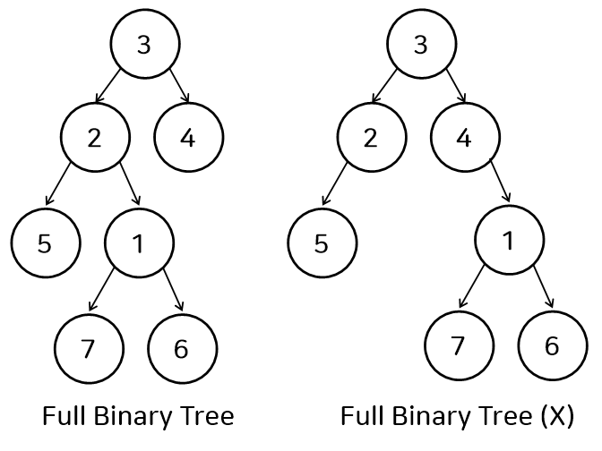
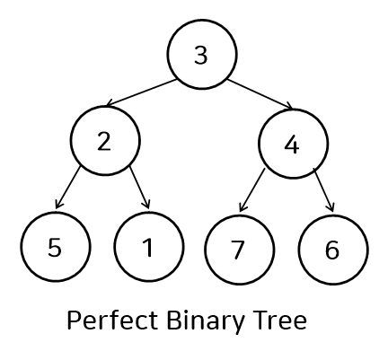
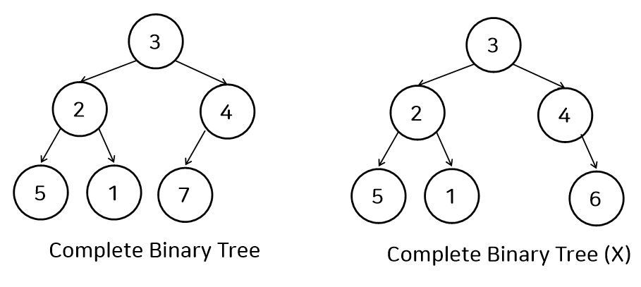

### Tree
트리는 노드로 이루어진 자료 구조
> 계층적 구조의 자료구조를 말한다. "root 노드" 부터 "leaf노드" 까지 계층적 구조로 되어있다.


#### nodes 
root : 부모가 없는 노드, 트리는 하나의 루트 노드만을 가진다.
<br> leaf : 자식이 없는 노드. external 노드라고도 부른다.
<br> internal nodes : leaf 노드를 제외한 노드들

#### realation
parent - child : 부모 자식 관계. 부모와 자식은 이어져 있다.
<br> siblings : 형제관계. 같은 부모를 가진 노드를 말한다.
<br> ancestors : 조상 노드. 부모 혹은 부모의 조상을 말한다.
<br> descendants : 자손 노드. 자식 혹은 자식의 자손을 말한다.
<br> 
#### 노드가 가지는 값
depth : root 로 부터의 거리 (root의 depth는 0)
<br> parent : 부모를 가리키는 포인터
<br> childs : 자식을 가리키는 포인터들의 집합
<br> degree : 노드의 자식 수 (손자 X)
<br> subTree : 본인을 root로 하는 tree
<br> size : subTree의 size
<br> height : subTree의 height
<br>
#### others
level : 같은 depth를 가진 노드의 집합
<br> height : 트리의 높이. depth 중 가장 큰값.
<br> size : 노드의 개수

### 수행시간
#### worst case
find : O(n)
<br> -> insert,erase, update : O(n)

## 구현

전에 !!!!

#### 그럼 트리를 왜 쓸까?
구현 방식에 따라 O(logn)을 만족한다.

### 이진 트리

노드의 크기 (자식의 수) 가 2이하인 트리.

#### full binary tree (proper binary tree)
- 모든 node의 child가 2개 or 0개인 트리


> n : 노드의 개수
> <br>e : external(leaf) 노드의 수
> <br>i : internal 노드의 수
> <br>h : tree의 height
>
- e = i + 1
- n = 2e - 1 = 2i + 1

    ... 

교재에 있습니다..ㅎㅎ

#### perfect binary tree
- full binary tree 이면서 모든 leaf node의 depth가 같은 트리
- 꽉 찬 이진트리


#### complete binary tree
- tree의 depth가 d라고 할 때, depth가 d-1까지는 perfect binary tree이면서, depth가 d인 node(제일 아래 층 node들)은 왼쪽부터 오른쪽의 order대로 node가 채워져 있는 트리
- 왼쪽 부터 채운 트리 




## 구현


<a href = https://github.com/Landvibe-DataStructure-2024/StudyNotes/blob/main/w06/vector%EC%82%AC%EC%9A%A9%EB%B2%95.md>일단 이거 부터</a>


### Node
```cpp

class Node {
public:
    Node *parent;
    vector<Node *> childList;
    int val;
    int depth;

    Node(Node *p, int val) {
        this->parent = p;
        this->val = val;
        this->depth = parent->depth + 1;
    }

    Node(int val, int depth) {
        parent = nullptr;
        this->val = val;
        this->depth = depth;
    }
};
```
### Tree

```cpp
class Tree {
public:
    Node *root;
    vector<Node *> nodeList;

    Tree() {
        root = new Node(1, 0);
        nodeList.emplace_back(root);
    }
    
    Node *findNode(int x) {
        for (auto node: nodeList) {
            if (node->val == x) {
                return node;
            }
        }
        return nullptr;
    }

    void insert(int x, int y) {
        Node *parentNode = findNode(x);
        if (parentNode == nullptr || findNode(y) != nullptr) {
            cout << -1 << '\n';
            return;
        }
        Node *newNode = new Node(parentNode, y);
        parentNode->childList.emplace_back(newNode);
        nodeList.push_back(newNode);
    }

    void erase(int x) {
        Node *delNode = findNode(x);
        if (delNode == nullptr) {
            cout << -1 << '\n';
            return;
        }
        for (auto node: delNode->childList) {
            delNode->parent->childList.emplace_back(node);
            node->parent = delNode->parent;
        }
        for (int i = 0; i < delNode->parent->childList.size(); i++) {
            if (delNode->parent->childList[i] == delNode) {
                delNode->parent->childList.erase(delNode->parent->childList.begin() + i);
                break;
            }
        }
        for (int i = 0; i < nodeList.size(); i++) {
            if (nodeList[i] == delNode) {
                nodeList.erase(nodeList.begin() + i);
                break;
            }
        }

    }

    void parent(int x) {
        Node *targetNode = findNode(x);
        if (targetNode == nullptr) {
            cout << -1 << '\n';
            return;
        }
        cout << targetNode->parent->val << '\n';

    }

    void child(int x) {
        Node *targetNode = findNode(x);
        if (targetNode == nullptr || targetNode->childList.empty()) {
            cout << -1 << '\n';
            return;
        }
        for (auto node: targetNode->childList) {
            cout << node->val << ' ';
        }
        cout << '\n';

    }
};
```

