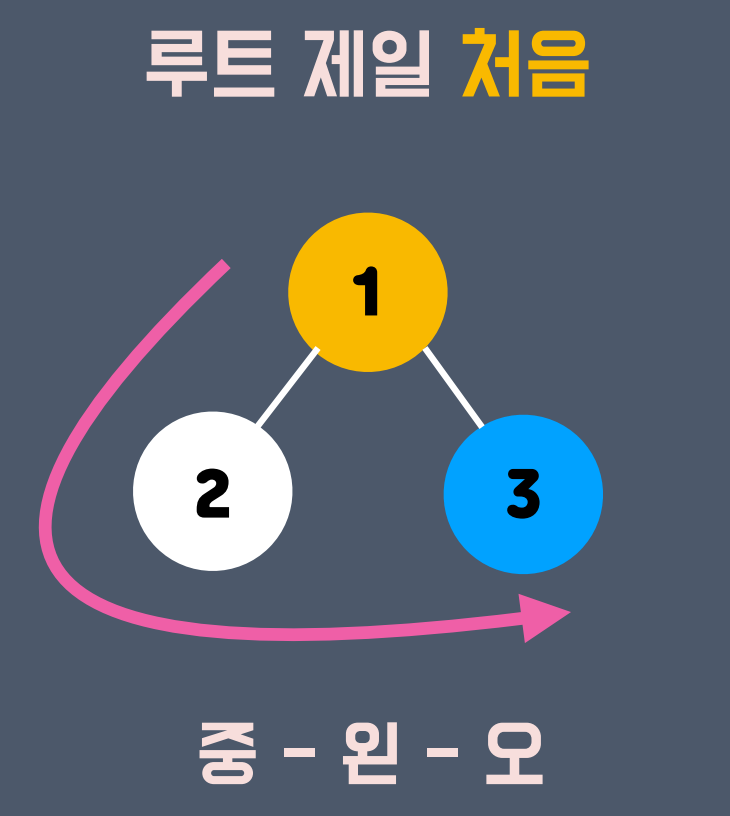
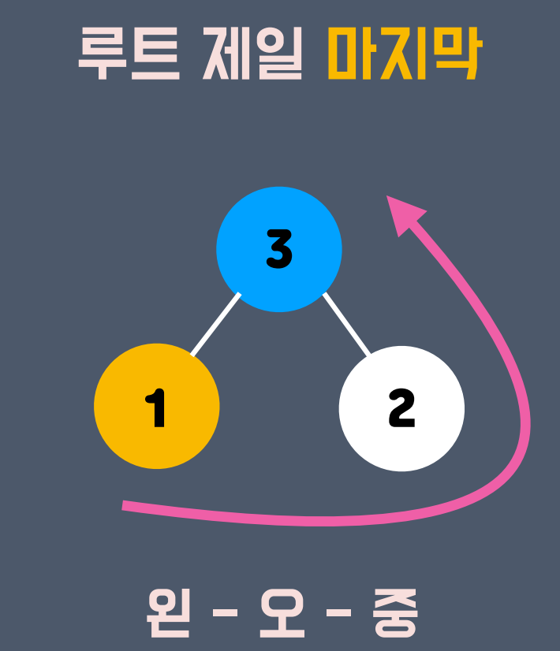
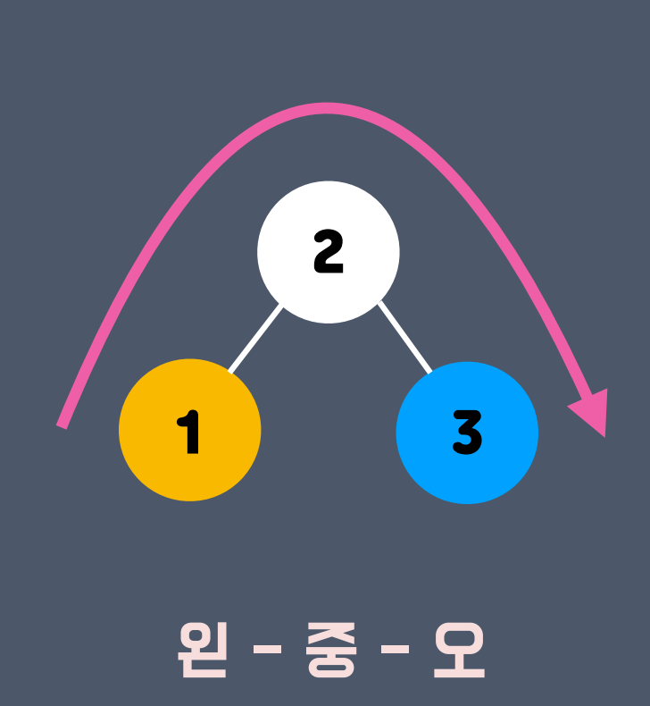
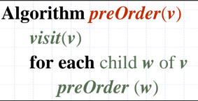
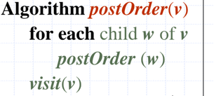
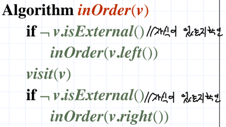

## 트리 순회 : Tree Traversal


### 트리 순회란?
트리를 탐색하는 방법.
- 트리는 노드로 이루어진 계층적 자료구조.
- 어떤 순서로 노드에 접근할까?

#### 종류

- 전위 순회 



부모 -> 자식


- 후위 순회



자식 -> 부모


- 중위 순회



왼쪽 자식 -> 부모 -> 오른쪽 자식


### 전위 순회


v 노드를 탐색 하고 <br> v 노드의 자식을 탐색 한다.

### 후위 순회


v 노드의 자식을 탐색 하고 <br> v 노드를 탐색 한다.


### 중위 순회


v 노드의 왼쪽 자식을 탐색 하고<br> v 노드를 탐색 하고<br> v 노드이 오른쪽 자식을 탐색 한다.

## 구현
- 탐색 순서대로 출력하기

### preOrderTraversal
```cpp
void preOrderTraversal(Node *node) {
    cout << node->val << ' ';
    for (Node *child: node->childList) {
        preOrderTraversal(child);
    }
}
```
### postOrderTraversal
```cpp
void postOrderTraversal(Node *node) {
    for (Node *child: node->childList) {
        postOrderTraversal(child);
    }
    cout << node->val << ' ';
}
```

### inOrderTraversal
```c++
void inOrderTraversal(Node *node) {
    int flag = node->childList.size() / 2;
    for (int i = 0; i < flag; i++) {
        inOrderTraversal(node->childList[i]);
    }
    cout << node->val << ' ';
    for (int i = flag; i < node->childList.size(); i++) {
        inOrderTraversal(node->childList[i]);
    }
}
```
#### in binary tree
```cpp
void inOrderTraversalInBinaryTree(Node *node) {
    inOrderTraversalInBinaryTree(node->lChild);
    cout << node->val << ' ';
    inOrderTraversalInBinaryTree(node->rChild);
}
```

<a href="https://github.com/Landvibe-DataStructure-2024/StudyNotes/blob/main/w07/traversal.cpp"> tree with traversal </a>

<a href = "https://github.com/Landvibe-DataStructure-2024/references/tree/master/%EC%83%98%ED%94%8C%202023-1/week07">문제</a>

<a href = "https://github.com/Landvibe-DataStructure-2024/references/tree/master/2023-1%EC%BD%94%EB%93%9C/w07">코드</a>
