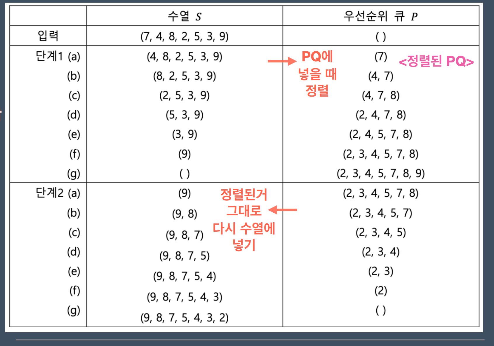

# 우선순위 큐

> Priority queue is an abstract data-type similar to a regular queue or stack data structure.<br>
> Each element in a priority queue has an associated priority.<br> 
> In a priority queue, elements with high priority are served before elements with low priority.

**⇒ 우선순위대로 저장되어 있는 자료구조**

- 가장 우선순위가 높은 데이터에 먼저 접근한다.
- 가장 우선순위가 높은 데이터부터 삭제된다.

#### vs 큐, 스택
삭제
- 큐 : 가장 먼저 들어온 데이터
- 스택 : 가장 최근에 들어온 데이터
- 우선순위 큐 : 가장 우선순위가 높은 데이터

### pq를 구현하는 다양한 방법
- insertion sort
- selection sort
- heap sort

### insertion sort : 삽입 정렬
우선순위에 맞게 삽입하면서 정렬하는 방법


```c++
//시퀀스 돌면서 적절한 위치에 삽입
for (int i = 0; i < pq.size(); i++) {
    if (cur < pq[i]) {
        pq.insert(pq.begin() + i, cur);
        return;
    }
}
```
이걸로 pq?
 
-> pq에 우선순위에 맞게 삽입하기

시간복잡도 : 
- 삽입 : O(n)
- 삭제,조회 : O(1)
### selection sort : 선택 정렬
우선순위에 맞게 선택하면서 정렬하는 방법


```c++
//무작정 저장해두고 우선순위에 맞게 선택하기
int cur;
for (int j = 0; j < pq.size(); j++) {
    if (pq[j] > cur) {
        cur = pq[j];
    }
}
seq.push_back(cur)
```
이걸로 pq?

-> pq에서 우선순위에 맞게 꺼내서 결과 시퀀스에 저장

시간복잡도 :
- 삽입 : O(1)
- 삭제,조회 : O(n)

### heap sort
실제로 우선순위큐가 구현된 방법<br>
다음주에 배울 예정

<a href = https://github.com/Landvibe-DataStructure-2024/references/blob/master/%EC%83%98%ED%94%8C%202023-1/week09/prob-W9_P1.pdf>문제 1</a>

<a href = https://github.com/Landvibe-DataStructure-2024/references/blob/master/2023-1%EC%BD%94%EB%93%9C/w09/w9p1>코드 v1</a>

<a href = https://github.com/Landvibe-DataStructure-2024/references/blob/master/2023-1%EC%BD%94%EB%93%9C/w09/w9p1v2.cpp> 코드 v2 </a>

<a href = https://github.com/Landvibe-DataStructure-2024/references/blob/master/%EC%83%98%ED%94%8C%202023-1/week09/prob-W9_P3.pdf>문제 3 </a>

<a href = https://github.com/Landvibe-DataStructure-2024/references/blob/master/2023-1%EC%BD%94%EB%93%9C/w09/w9p3.cpp> 코드 </a>

