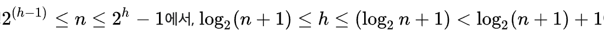
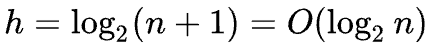

# HEAP (Priority Queue)
> 힙(heap)은 최댓값 및 최솟값을 찾아내는 연산을 빠르게 하기 위해 고안된 완전이진트리(complete binary tree)를 기본으로 한 자료구조(tree-based structure)로서 다음과 같은 힙 속성(property)을 만족한다.
>   - A가 B의 부모노드(parent node) 이면, A의 키(key)값과 B의 키값 사이에는 대소관계가 성립한다.
>   힙에는 두가지 종류가 있으며, 부모노드의 키값이 자식노드의 키 값보다 항상 큰 힙을 '최대 힙', 부모노드의 키 값이 자식노드의 키 값보다 항상 작은 힙을 '최소 힙'이라고 부른다.
>   키 값의 대소관계는 오로지 부모노드와 자식노드 간에만 성립하며, 특히 형제 사이에는 대소관계가 정해지지 않는다.

- 부모가 자식보다 우선순위가 높다.
  - 루트 노드 : 가장 우선순위가 높은 노드
  - 최대, 최소값을 빠르게 찾을 수 있다.
- 일반적으로 완전 이진트리로 구성된다. 
- 우선순위큐를 구현하는데에 사용된다. 

### Push
- 맨 뒤에 노드 추가
- 부모보다 우선 순위 높으면 swap

### Pop
- 루트 노드랑 마지막 노드 swap
  - 마지막 노드 삭제
- 루트에 적합한 값이 들어 있지 않음
  - 자식보다 우선 순위 낮으면 swap

### 복잡도 : O(log n)

