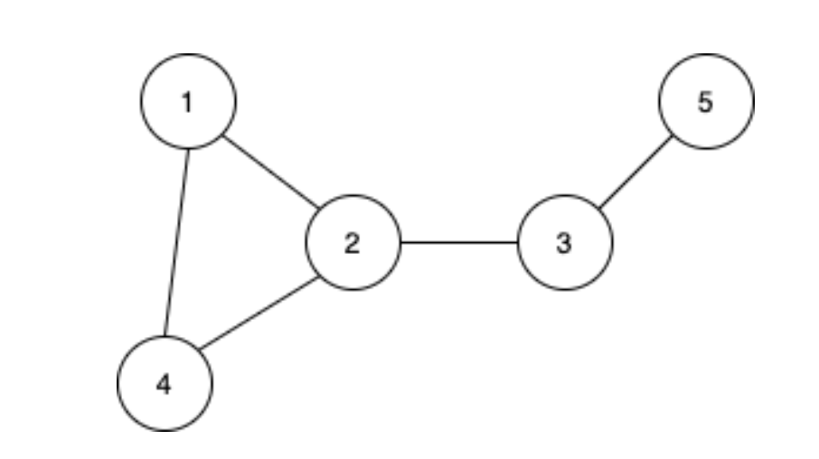
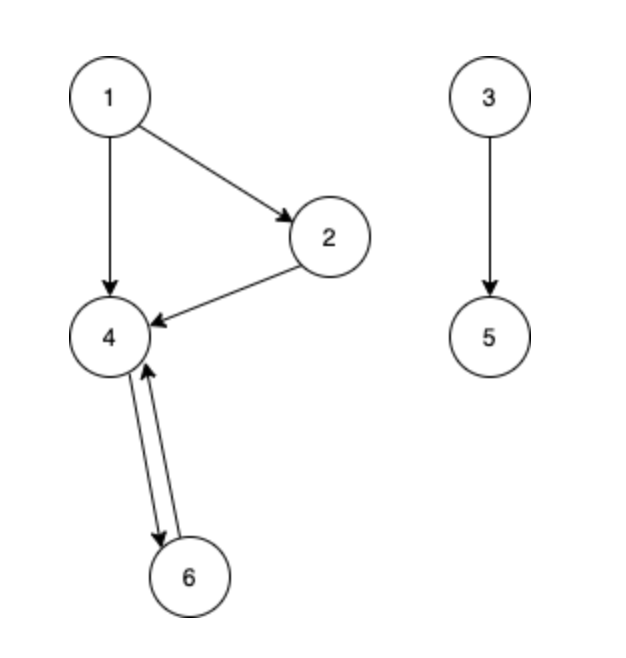

# Graph

> 객체 간에 짝을 이루는 관계를 모델링하기 위해 사용되는 자료 구조.

그래프(graph) 
- G = (V, E)
- V : vertex의 집합
  - vertex : 그래프에서 데이터를 담고 있는 자료구조
- E : edge의 집합
  - edge : (v1, v2)
    - vertex와 vertex로 이루어짐
    - vertex와 vertex를 잇는 자료구조
- 차수(Degree) : 정점 하나에 연결된 간선의 수


그래프 종류  : 그래프의 간선에 방향성이 있고 없고의 차이를 보여준다.
- 무향 그래프
- 유향 그래프

### 무향 그래프


- 그래프의 이름 그대로 간선에 방향성이 존재하지 않는다. 
- 그래서 1에서 4, 4에서 1의 이동이 모두 가능한 그래프이다. 
- 그래프의 간선을 표시할 때 보통 (1, 4)와 같이 표시하는데, 이 과정에서 순서가 정해지지 않은 pair가 된다. 
- 즉 무향 그래프에서는 (1,4)나 (4,1)이나 같은 간선을 말한다.

### 유향 그래프


- 간선에 방향성이 생긴 그래프다.
- 이 그래프는 무향 그래프와 다르게 (1,4)와 (4,1)은 서로 다른 간선을 나타내게 된다. 
- 간선이 방향성을 갖기 때문에 순서가 곧 방향성을 나타내기 때문이다. 
- 그래서 유향 그래프는 순서가 정해진 pair가 된다.

## 그래프 표현 방식
### 인접 행렬(Adjacent matrix)
- 정점 중심
- V * V 크기의 2차원 배열을 이용해서 간선 정보를 저장
- 그래프가 가중치가 없다면 boolean 형으로 연결 정보를 표현
- 가중치가 있다면 각 간선의 가중치를 배열로 저장
```c++
graph[][]
// v1-v2 무향 ,가중치 없음
graph[v1][v2] = true;
graph[v2][v1] = true;

// v1->v2 유향, 가중치 있음
graph[v1][v2] = weight;
```
### 인접 리스트(Adjacent List)
- 정점 중심
- 각 정점마다 다른 정점으로 나가는 간선의 정보를 저장
```cpp
vector<int>graph[];

graph[v1].push_back(v2);
graph[v2].push_back(v1);
```

간선 리스트(Edge List)
- 간선(시작 정점, 끝 정점)의 정보를 객체로 표현하여 리스트에 저장
```c++
vector<pair<int,int>>edges;

edges.push_back(v1,v2)
```

#### pair란?
자료형 두개로 이루어진 자료구조
```cpp
// 사용법
pair<int,int> pair1; // 선언
pair1.first = 1;
pair1.second = 2;
```

### 그래프 구현
```cpp
bool vertices[10002]; // 노드가 있는지
bool graph[10002][10002];
```
#### vertex 추가
```c++
void insertVertex(int s) {
    if (vertices[s]) {
        cout << "Exist\n";
        return;
    }
    vertices[s] = true;
}
```
#### edge 추가
```c++
void insertEdge(int s, int d) {
    if (graph[s][d]) {
        cout << "Exist\n";
        return;
    }
    graph[s][d] = true;
    graph[d][s] = true;
}
```
#### edge 삭제
```c++
void eraseEdge(int s, int d) {
    if (!graph[s][d]) {
        cout << "None\n";
        return;
    }
    graph[s][d] = false;
    graph[d][s] = false;
}
```
